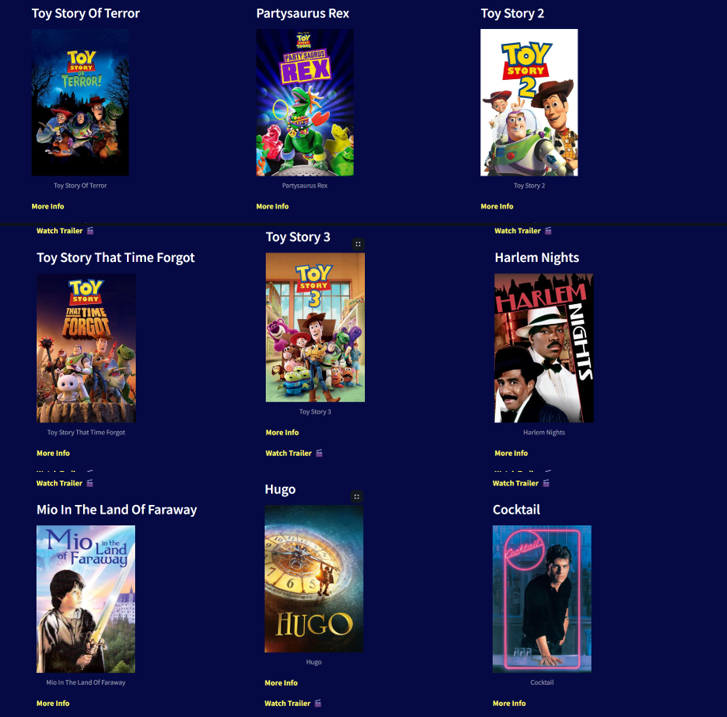
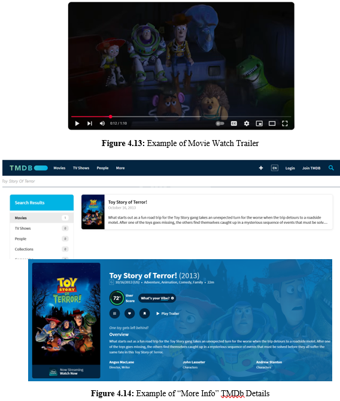

# Movie Recommendation System

An AI-powered Movie Recommendation System developed for an Artificial Intelligence assignment. This project combines content-based filtering, collaborative filtering, and a hybrid recommendation approach to generate personalized movie suggestions through an interactive Streamlit application.

## Project Overview

With the rapid growth of streaming platforms, users often face content overload and decision fatigue when trying to find movies that match their interests. This project addresses that challenge by building a recommendation system that improves movie discovery through machine learning and recommendation algorithms.

The system integrates:
- Content-Based Filtering
- Collaborative Filtering
- Hybrid Recommendation
- Streamlit-based user interface

### 📸 System Interface





## Objectives

The main objectives of this project are:

- Build a content-based recommendation model using TF-IDF vectorization and similarity measures
- Implement a collaborative filtering model using KNN-based recommendation
- Develop a hybrid recommendation system using weighted combination of both models
- Address cold-start and data sparsity issues
- Deploy the recommendation engine through a user-friendly Streamlit application

## Team Members

- Wong Jin Xuan (2314630) – Content-Based Filtering Model
- Dorcas Lim Yuan Yao (2314535) – Hybrid Model
- Tan Yen Ping (2314615) – Collaborative Filtering Model

## Features

- Recommend movies based on content similarity
- Recommend movies based on user ratings
- Combine both methods using hybrid recommendation
- Interactive Streamlit interface
- Movie posters, trailers, and TMDb links
- Adjustable hybrid weighting parameter
- Support for cleaned/preprocessed datasets

## Models Implemented

### 1. Content-Based Filtering
Uses movie metadata such as:
- genres
- cast
- director
- keywords
- release year

Main techniques:
- TF-IDF Vectorization
- Sigmoid Kernel Similarity

### 2. Collaborative Filtering
Uses user rating behavior to predict preferences.

Main techniques:
- KNN-based collaborative filtering
- GridSearchCV for hyperparameter tuning
- Item-based similarity with Pearson / related similarity measures

### 3. Hybrid Recommendation
Combines content-based and collaborative filtering scores using a weighted average controlled by an alpha parameter.

## Dataset

This project uses movie metadata and rating datasets derived from The Movies Dataset / MovieLens style data.

Main files used:
- `movies_metadata.csv`
- `ratings_small.csv`
- `credits.csv`
- `keywords.csv`

Processed data:
- `CleanedData/movies_cleaned.csv`
- `CleanedData/ratings_cleaned.csv`

## Project Structure

```text
MovieRecommendationSystem/
├── CleanedData/
│   ├── movies_cleaned.csv
│   └── ratings_cleaned.csv
├── DataPreprocessing.ipynb
├── Content-Based Filtering.ipynb
├── Collaborative Filtering.ipynb
├── Hybrid.ipynb
├── movie_recommendations.py
├── credits.csv
├── keywords.csv
├── movies_metadata.csv
├── ratings_small.csv
├── requirements.txt
├── README.md
└── .gitignore
```
---

## ⚠️ Large Files Notice

Pickle files and trained model artifacts are not uploaded to this repository because they are too large.

These may include files such as:

- trained collaborative filtering model  
- similarity matrix  
- TF-IDF vectorizer  
- saved movie indices  
- other precomputed model objects  

---

## 🚀 How to Run

### Option 1: Run with existing preprocessed data and external model files

1. Clone this repository:
   ```bash
   git clone <your-repo-link>
   cd MovieRecommendationSystem
2. Install dependencies:
pip install -r requirements.txt
3. Download the large model files / pickle folder from your external storage link
4. Place the downloaded folder in the same directory as movie_recommendations.py
5. Run the app:
streamlit run movie_recommendations.py

### Option 2: Rebuild from notebooks

Run the notebooks in the following order:
1. DataPreprocessing.ipynb
2. Content-Based Filtering.ipynb
3. Collaborative Filtering.ipynb
4. Hybrid.ipynb

Then run:
streamlit run movie_recommendations.py

## 🛠️ Technologies Used
- Python
- Pandas
- NumPy
- Scikit-learn
- Surprise
- Streamlit
- Joblib / Pickle
- TMDb API

## 📊 Evaluation Metrics

The project evaluates recommendation performance using:

- Precision@K
- Recall@K
- RMSE
- MAE
  
## 👨‍💻 My Contribution

Wong Jin Xuan focused on the Content-Based Filtering model, including:

- Metadata feature selection
- TF-IDF vectorization
- Sigmoid kernel similarity computation
- Recommendation generation
- Hyperparameter tuning
- Precision-recall evaluation

## ⚠️ Limitations
- Large model files are excluded from GitHub
- Collaborative filtering may struggle with sparse user-item data
- Real-time scaling is limited by precomputed similarity artifacts
- Hybrid weighting is currently static and manually tuned

## 🔮 Future Improvements
- Replace TF-IDF with richer embeddings such as BERT
- Explore neural collaborative filtering
- Implement dynamic hybrid weighting
- Improve scalability with faster similarity search
- Add caching for metadata and external API results

## 📌 Author

Developed for academic purposes as an Artificial Intelligence project by Group 3.
